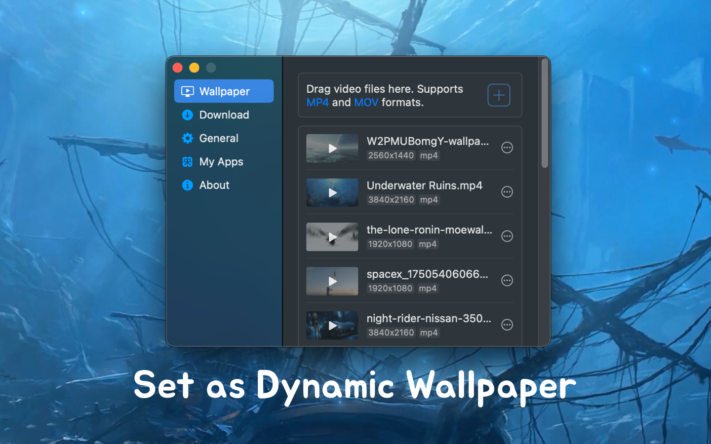

<!--idoc:ignore:start-->
> [!TIP]
> Declaration: This project is not an open-source project. The repository serves as the official website, used to collect issues and user demands. This is done to save costs, because without an official website, the application cannot pass the review.
<!--idoc:ignore:end-->

   
   
  
  <h1>
    VidCrop
  </h1>
  <!--rehype:style=border: 0;-->
  

    <a href="./README.zh.md">简体中文</a> • 
    <a target="_blank" href="https://github.com/jaywcjlove/vidcrop/issues/new?template=bug_report.yml">Contact & Support</a> • 
    <a href="./CHANGELOG.md">Changelog</a>
  

  

    
  

VidCrop is a video cropping tool that helps you easily crop video files. You can manually select any part of the video to crop, with an integrated video player allowing you to preview before and after cropping.

## Key Features

- Supports common video formats such as .mp4, .m4v, .mov, .mpg, .mpeg, and .3gp.
- Users can adjust the cropping frame by dragging or customize the video size to crop any part of the video with precision.