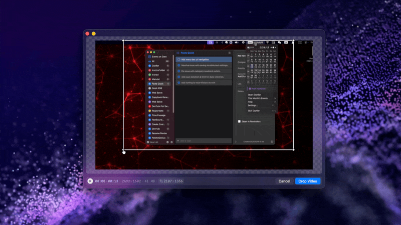
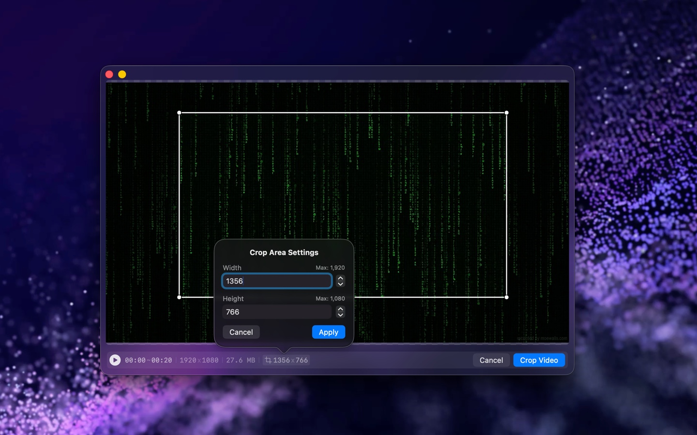

<!--idoc:ignore:start-->
> [!TIP]
> 声明：此项目并非开源项目，仓库作为官方网站，用于收集问题和用户需求。这样做是为了节省成本，因为没有官网，应用无法通过审核。
<!--idoc:ignore:end-->

   
   
  
  <h1>
    VidCrop
  </h1>
  <!--rehype:style=border: 0;-->
  

    <a href="./README.md">English</a> • 
    <a target="_blank" href="https://github.com/jaywcjlove/vidcrop/issues/new?template=bug_report_cn.yml">联系&支持</a> • 
    <a href="./CHANGELOG.zh.md">更新日志</a>
  

  

    
  

VidCrop 是一款视频裁剪工具，帮助用户轻松裁剪视频文件。您可以手动选择视频的任意部分进行裁剪，程序内置视频播放器，方便在裁剪前后查看预览。

## 主要功能

- 支持 .mp4, .m4v, .mov, .mpg, .mpeg, .3gp 等常见视频格式。
- 用户可以通过拖动调整裁剪框或自定义视频尺寸，精确裁剪视频的任意部分。

<!--idoc:config:
title: VidCrop
keywords: 视频裁剪, 视频编辑, 视频处理, 裁剪工具, 视频预览, 视频格式支持, 视频剪切, .mp4, .m4v, .mov, .mpeg, .3gp, 剪辑, 视频工具, 视频大小调整
description: 一款视频裁剪工具，帮助用户轻松裁剪视频文件
-->